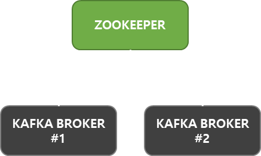
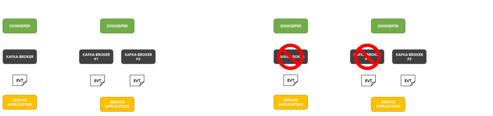

# Kafka Cluster, Docker 배포

Kafka Cluster 를 구성하여 Docker Container 로 배포하는 과정을 설명합니다.   
<br />

Kafka 와 Zookeeper 는 공식으로 제공되는 컨테이너 이미지가 존재하지 않습니다.   
Confluent 에서 제공하는 이미지와 여러 환경 변수를 통해 간편하게 환경을 구성할 수 있습니다.
> <a href="https://hub.docker.com/r/confluentinc/cp-kafka">Docker Hub - confluentinc/kafka</a>

<br />
<br />

해당 예제는 **CentOS 7**을 기준으로 설명합니다.
> CentOS 7 Docker 환경을 구성하려면 다음 링크를 참고하세요.   
> <a href="https://github.com/jeongwon201/docker/tree/main/docs/docker-1-env">CentOS 7, Docker 환경 구성</a>

<br />
<br />

Zookeeper 와 Kafka 컨테이너를 빠르게 구성하기 위해 **Docker Compose** 플러그인을 사용합니다.   
<br />
`yum install -y docker-compose-plugin` 명령어로 Docker Compose 를 설치합니다.
<br />
<br />
<br />
<br />

## Kafka Cluster 란?

여러 대의 Kafka Broker 가 클러스터를 형성한 것을 **Kafka Cluster** 라고 합니다.   
<br />
<br />
<div align="center">
  
</div>
<br />
<br />

Kafka Cluster 를 구성하게되면 부하를 방지하거나, 레플리케이션을 구성하여 고가용성을 유지할 수 있습니다.   

<br />
<br />
<div align="center">
  
</div>
<br />
<br />

Apache Kafka 에서는 Kafka Cluster 구성 시 홀수 개 및 최소 3 개 이상의 Kafka Broker 로 구성하는 것을 권장합니다.   
<br />
<br />
<br />
<br />

## Kafka Cluster 구성

`su -` 명령어를 이용해 루트 계정으로 접속합니다.   
`mkdir kafka` 명령어로 디렉토리를 생성 후, `cd kafka` 명령어로 kafka 디렉터리로 이동합니다.   
<br />

`vi docker-compose.yml` vi 편집기를 이용해 `docker-compose.yml` 파일을 작성합니다.   
<br />

`docker-compose.yml` 내용은 다음과 같습니다.
```yaml
version: '2'
services:
  zookeeper:
    image: confluentinc/cp-zookeeper:latest
    environment:
      ZOOKEEPER_CLIENT_PORT: 2181
      ZOOKEEPER_TICK_TIME: 2000
    ports:
      - "2181:2181"

  kafka-1:
    image: confluentinc/cp-kafka:latest
    depends_on:
      - zookeeper

    ports:
      - "19092:19092"
    environment:
      KAFKA_BROKER_ID: 1
      KAFKA_ZOOKEEPER_CONNECT: zookeeper:2181
      KAFKA_ADVERTISED_LISTENERS: INTERNAL://kafka-1:9092,EXTERNAL://localhost:19092
      KAFKA_LISTENER_SECURITY_PROTOCOL_MAP: INTERNAL:PLAINTEXT,EXTERNAL:PLAINTEXT
      KAFKA_INTER_BROKER_LISTENER_NAME: INTERNAL
      KAFKA_OFFSETS_TOPIC_REPLICATION_FACTOR: 1
  kafka-2:
    image: confluentinc/cp-kafka:latest
    depends_on:
      - zookeeper
    ports:
      - "29092:29092"
    environment:
      KAFKA_BROKER_ID: 2
      KAFKA_ZOOKEEPER_CONNECT: zookeeper:2181
      KAFKA_ADVERTISED_LISTENERS: INTERNAL://kafka-2:9092,EXTERNAL://localhost:29092
      KAFKA_LISTENER_SECURITY_PROTOCOL_MAP: INTERNAL:PLAINTEXT,EXTERNAL:PLAINTEXT
      KAFKA_INTER_BROKER_LISTENER_NAME: INTERNAL
      KAFKA_OFFSETS_TOPIC_REPLICATION_FACTOR: 1
```
<br />

**Zookeeper** 의 환경 변수에 대한 설명은 다음과 같습니다.
- `ZOOKEEPER_CLIENT_PORT`
    - 인증되지 않은 사용자의 연결을 허용합니다.
- `ZOOKEEPER_TICK_TIME`
    - Zookeeper 의 틱 타임을 설정합니다.

<br />

**Kafka** 의 환경 변수에 대한 설명은 다음과 같습니다.
- `KAFKA_BROKER_ID`
    - Zookeeper 가 Kafka 브로커를 식별하기 위한 ID 값을 설정합니다.
- `KAFKA_ZOOKEEPER_CONNECT`
    - Kafka 와 연동할 Zookeeper 를 설정합니다.
- `KAFKA_ADVERTISED_LISTENERS`
    - 컨테이너 외부에서 접속할 포트를 설정합니다.
- `KAFKA_LISTENER_SECURITY_PROTOCOL_MAP`
    - Kafka 리스너와 보안 프로토콜을 매핑합니다.
- `KAFKA_INTER_BROKER_LISTENER_NAME`
    - Kafka 브로커 간 통신에 사용할 리스너를 설정합니다.
- `KAFKA_OFFSETS_TOPIC_REPLICATION_FACTOR`
    - 레플리케이션을 설정합니다.

<br />
<br />

```docker compose up -d``` 명령어로 컨테이너를 실행합니다.
<br />
<br />
<br />
<br />