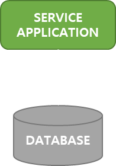
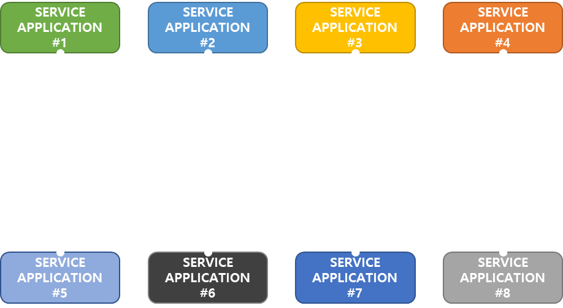
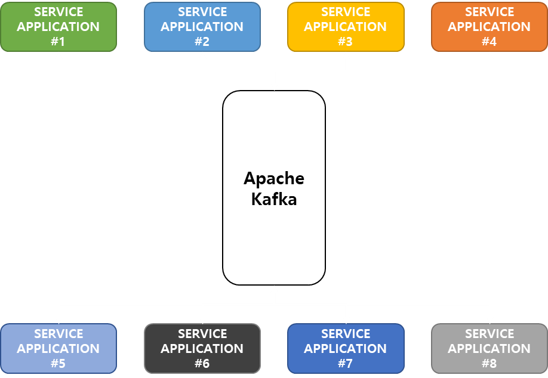
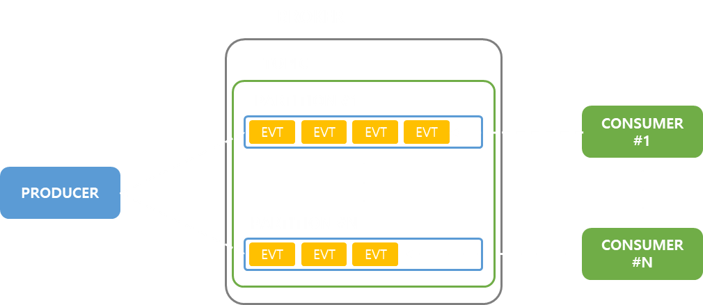
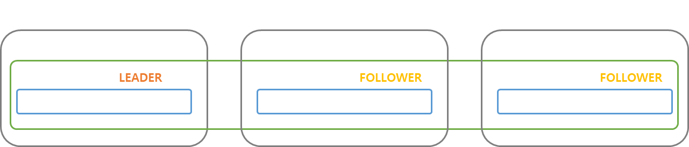

# Apache Kafka
Apache Kafka 에 대한 개념입니다.   
Apache Kafka Docs 의 내용과 유튜브 데브원영님의 Kafka 관련 영상을 참고하였습니다.   
 

<a href="https://kafka.apache.org/documentation/">Apache Kafka Docs</a>   
<a href="https://www.youtube.com/@DevWonYoung">데브원영 YouTube</a>
 
 
 
 

## 이벤트 스트리밍이란 ?
이벤트 스트리밍이란 DB, 센서, 모바일 장치, 클라우드 서비스 및 소프트웨어 애플리케이션과 같은   
이벤트 소스에서 이벤트 스트림의 형태로 데이터를 실시간으로 캡처하는 작업을 말합니다.   
 

나중에 검색하기 위해 이러한 이벤트 스트림을 지속적으로 저장합니다.   
 

필요에 따라 이벤트 스트림을 다른 곳으로 라우팅할 수 있습니다.   
 

이벤트 스트리밍은 데이터의 지속적인 흐름과 해석을 보장하여   
데이터가 적절한 시간에 적절한 장소에 위치할 수 있도록 합니다.   
 
 
 
 

## Apache Kafka 란?
Apache Kafka 는 고성능 TCP 네트워크 프로토콜을 통해 통신하는 서버와 클라이언트로 구성된 분산 시스템으로,   
이벤트 스트리밍 플랫폼입니다.   
 

Kafka 는 하나 이상의 서버 클러스터로 실행됩니다.   
서버 클러스터 중 특정 기능을 하는 서버 일부를 브로커라고하며,   
브로커는 이벤트 스트림을 저장하는 스토리지를 가지고 있습니다.   
 

다른 서버는 Kafka Connect 를 실행하여 데이터를 이벤트 스트림으로   
끊임없이 가져오고 내보내면서 기존 시스템과 통합하는 작업을 수행합니다.   
 

Kafka 는 하나의 서버에 오류가 발생하였을 때 다른 서버가 작업을 인계받아   
데이터 손실없이 지속적인 운영을 가능하게 하는 고가용성을 보장합니다.   
 

클라이언트는 고가용성이 보장되는 서버에 대해 이벤트 스트림을 병렬로 읽고 처리할 수 있는   
분산 애플리케이션 및 마이크로 서비스를 작성할 수 있습니다.   
 
 
 
 

## Kafka 를 왜 사용하는 건가요?
기존 애플리케이션은 데이터를 전송하는 애플리케이션과   
데이터를 받는 애플리케이션이 단방향으로 통신을 하는 형태였습니다.   
 
 

    

 
 

그러나 점점 애플리케이션이 많아지고 규모가 커지면서,   
데이터를 전송하는 애플리케이션과 데이터를 받는 애플리케이션 간 데이터 송수신 라인이 매우 복잡해졌습니다.   
 
 

    

 
 

이러한 구조의 시스템은 추후에 변경 사항이 있을 때, 유지 보수가 매우 어려웠습니다.   
 

복잡한 시스템 구조에서 오는 단점을 극복하고자 Kafka 가 등장하였습니다.   
 
 

    

 
 
 
 

## Kafka 의 주요 개념 및 용어
Kafka 의 구조는 다음과 같습니다.   
 
 

    

 
 

### 이벤트
Kafka 의 이벤트 스트리밍 플랫폼으로서, 데이터를 읽거나 쓸 때 이벤트 형식으로 수행합니다.   
 

이벤트란 세상에서 "어떤 일이 일어났다"는 사실을 의미합니다.   
이러한 이벤트는 키, 값, 타임스탬프로 이루어져 있습니다.   
- 키 : "홍길동"
- 값 : "A게시판 글 작성"
- 타임 스탬프 : "2023-01-25 14:00"
 

### 생산자(Producer)
이벤트를 Kafka 에 게시하는 클라이언트 애플리케이션을 생산자라고합니다.   
 

### 소비자(Consumer)
이벤트를 구독(Subscribe)하여 이벤트를 처리하는 애플리케이션을 소비자라고 합니다.
 

생산자와 소비자는 서로 완전히 분리되어있으며, Kafka 의 높은 확장성을   
달성하기 위한 핵심 설계 요소입니다.   
 

### 토픽(Topic)
이벤트는 토픽에 구성되고 영구적으로 저장됩니다.   
쉽게 말해 토픽은 파일 시스템의 폴더이며, 이벤트는 해당 폴더의 파일입니다.   
 

토픽의 이벤트는 기존 메시징 시스템과 달리 소비 후 삭제되지 않지만,   
이벤트를 유지하는 기간을 정의하여 만료된 이벤트를 삭제합니다.   
 

Kafka 의 성능은 데이터 크기와 관련하여 실질적으로 일정하므로,   
장기간 데이터를 저장해도 괜찮습니다.   
 

### 파티션(Partition)
토픽은 여러 파티션으로 분할되며, 서로 다른 브로커에 있는   
여러 토픽에 이벤트가 분산되어 저장됩니다.   
 

이러한 분산 배치는 클라이언트 애플리케이션이 여러 브로커에서 동시에   
데이터를 읽고 쓸 수 있도록 하기에 확장성에서 매우 중요한 요소입니다.   
 

실제로 새 이벤트가 토픽에 게시되면, 해당 토픽의 파티션 중 하나에 추가됩니다.
 

동일한 키가 있는 이벤트는 동일한 파티션에 기록되며,   
Kafka 는 소비자가 파티션의 이벤트를 작성된 순서와 동일한 순서로    
소비되는 것을 보장합니다.   
 

### 레플리케이션(Replication)
브로커가 더 이상 가동 불가능한 상태에 도달하는 문제에 대비하여,   
데이터의 사본을 가지도록 브로커를 구성할 수 있습니다.   
이를 레플리케이션이라고 하며, 토픽의 파티션 수준에서 수행됩니다.   
 
 

    

 
 

레플리케이션은 일반적으로 3개의 브로커로 구성합니다.   
 

원본 파티션을 리더 파티션, 사본 파티션을 팔로워 파티션이라고 합니다.   
 

이벤트가 리더 파티션에 게시되면, 팔로워 파티션에 이벤트를 복제합니다.   
만약 리더 파티션이 제기능을 못하게 되면, 팔로워 파티션이 리더 파티션의   
역할을 위임받아 서비스를 유지합니다.   
 
 
 
 

## Kafka 사용 사례
Kafka 는 많은 곳에서 활용되고 있으며, 주로 사용되는 사례는 다음과 같습니다.   
 

### 메시징
Kafka 는 전통적인 메시지 브로커(RabbitMQ ...)의 역할의 대체가 가능합니다.   
대부분의 메시징 시스템과 비교하여 Kafka 는 더 나은 처리량, 기본 제공 파티셔닝, 복제 및 내결함성을   
갖추고 있어 대규모 메시지 처리 애플리케이션에 적합한 솔루션입니다.   
 

### 웹 사이트 활동 추적
Kafka 의 원래 사용 사례는 실시간 게시 · 구독 피드 세트로   
사용자의 활동 추적 파이프라인을 다시 빌드하는 것이었습니다.   
활동을 감지하여 토픽에 게시하여, 이를 관리합니다.   
 

### 모니터링
운영 데이터의 중앙 집중식 피드를 생성하기 위해 분산된 애플리케이션의 통계를 집계합니다.   
 

### 로그 집계
Kafka 는 많은 시스템에서 로그 집계 솔루션으로 사용되고 있습니다.   
로그 집계는 일반적으로 서버에서 물리적 로그 파일을 수집하여 처리를 위해 중앙 위치에 보관합니다.   
Kafka 는 파일의 세부 정보를 추상화하고, 로그 또는 이벤트 데이터를 메시지 스트림으로 보다 명확하게 추상화합니다.   
이를 통해 처리 지연 시간을 단축하고 여러 데이터 소스 및 분산 데이터 소비를 보다 쉽게 지원할 수 있습니다.   
 

### 스트림 처리
데이터의 실시간 처리를 위해 Kafka Streams 라이브러리를 통해 스트림 처리가 가능합니다.   
 

### 이벤트 소싱
이벤트 소싱 아키텍처의 핵심 요소로 사용될 수 있습니다.   
 

### 커밋 로그
분산 시스템을 위한 일종의 외부 커밋 로그 역할을 할 수 있습니다.   
로그는 노드 간 데이터를 복제하는데 도움이 되며, 실패한 노드가 데이터를 복원하도록   
재동기화 메커니즘 역할을 합니다.
