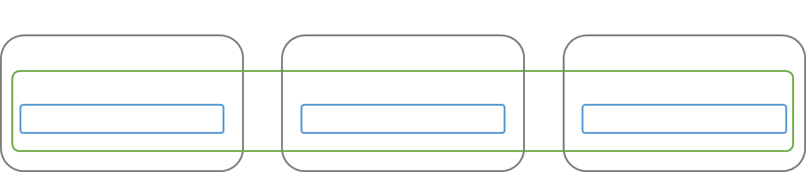
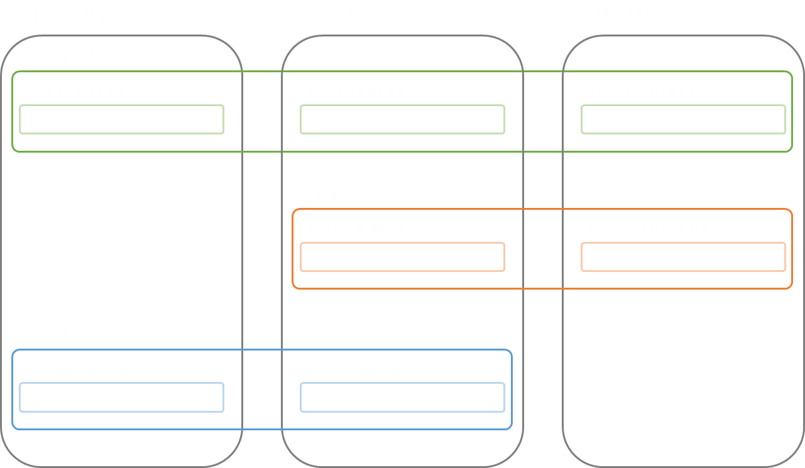
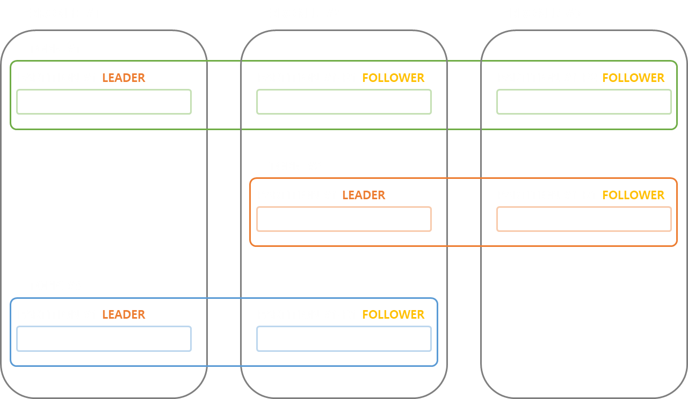
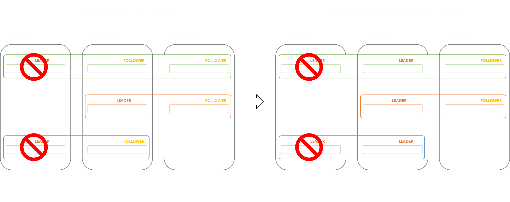
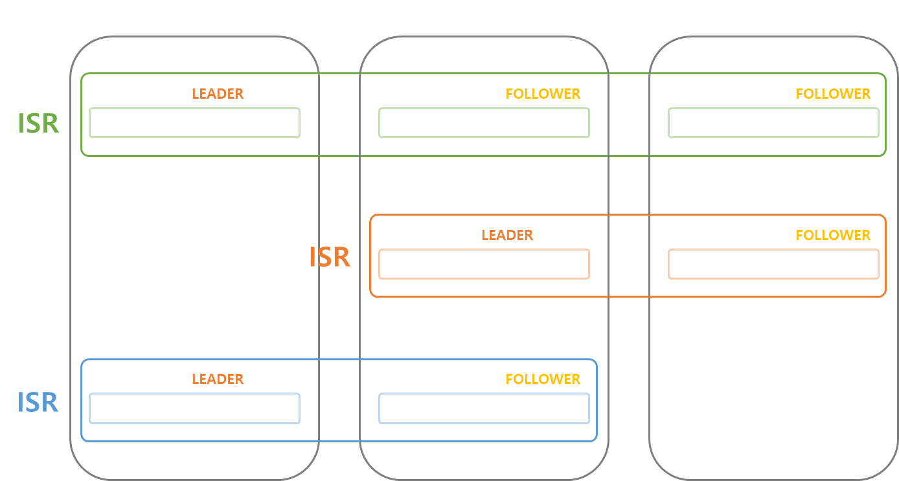
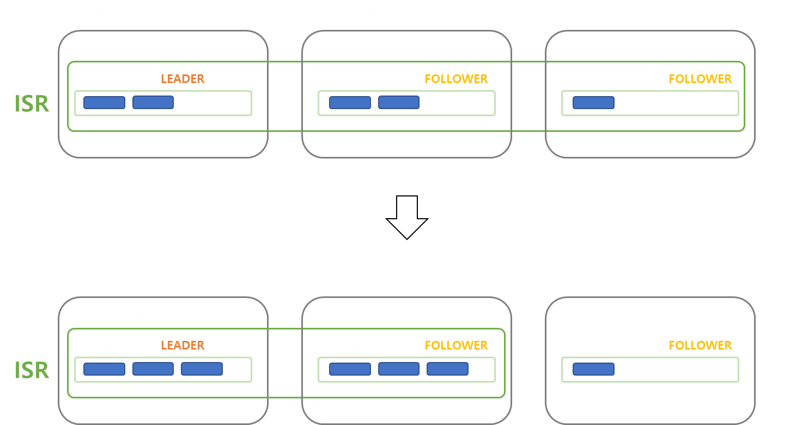

# Kafka Replication

Kafka Replication 에 대해 설명합니다.   
 

> Kafka Replication 에 대해 학습하기 전 Kafka 및 Kafka Cluster 에 대한 전반적인 이해가 필요합니다.   
> - <a href="https://github.com/jeongwon201/kafka/tree/main/kafka-concept">Kafka Concept</a>   
> - <a href="https://github.com/jeongwon201/kafka/tree/main/deploy-kafka-cluster-docker-container">Kafka Cluster</a>

 

## Kafka Replication 이란 ?

Kafka 의 특징 중 하나가 고가용성을 보장하는 것입니다.   
Kafka 는 고가용성을 보장하기 위해 Replication 이라는 기능을 제공합니다.   

Kafka Replication 이란 토픽의 파티션을 Kafka Cluster 의 여러 브로커에 복제하는 기능을 말합니다.   
 
 

    

 
 
 
 

## 토픽의 `replication-factor` 속성
Kafka Replication 은 토픽의 `replication-factor` 속성을 통해 설정할 수 있습니다.   
 

`replication-factor` 속성이 3 인 토픽 `TOPIC#1`, `replication-factor` 속성이 2 인 토픽`TOPIC#2`, `TOPIC#3` 을 생성합니다.   

 
 

    

 
 

`replication-factor` 속성의 값을 크게 설정하면, 고가용성이 증가하게 되지만,   
그만큼 디스크 공간을 차지하기 때문에, 적당한 크기로 설정하는 것이 좋습니다.   
 
 
 
 

## Leader Partition, Follower Partition

복제된 파티션은 Leader 와 Follower 파티션으로 구분됩니다.   
 
 

    

 
 

Leader 파티션은 Producer 와 Consumer 의 요청을 처리하며 이벤트를 저장합니다.   
 

Follower 파티션은 Leader 파티션에게 짧은 주기로 끊임없이 이벤트 복제를 요청합니다.   
Leader 파티션의 응답으로 이벤트를 복제하여 Leader 파티션과 자신을 동일한 상태로 유지합니다.   
 

만약 BROKER#1 에서 에러가 발생하여 더 이상 작업을 할 수 없을 경우,   
다른 브로커에 있는 Follower 파티션 중 하나가 Leader 파티션의 역할을 위임받아 고가용성을 유지합니다.   
 
 

    

 
 
 
 

## ISR(In-Sync Replica)

ISR(In-Sync Replica) 란 `replication-factor` 속성으로 복제된 파티션의 그룹을 말합니다.   
 
 

    

 
 

ISR 내 Follower 파티션은 모두 Leader 역할을 위임할 수 있습니다.   
 

만약 Follower 파티션이 Leader 파티션을 복제하려 요청을 보내기 직전에,   
Leader 파티션이 존재하는 브로커가 작업을 수행할 수 없는 상황이 되었을 경우를 가정합니다.   
 

ISR 내 Follower 파티션은 모두 Leader 역할을 위임받을 수 있어야 하는데,   
데이터의 동기화가 일어나지 않은 파티션이 존재하는 상황이 발생하게 됩니다.   
 

이러한 상황을 방지하기 위해 ISR 은 주기적으로 Follower 파티션을 검사하여,   
일정 시간동안 데이터가 동기화되지 않은 Follower 파티션을 ISR 에서 제외시켜버립니다.   
 
 

    

 
 